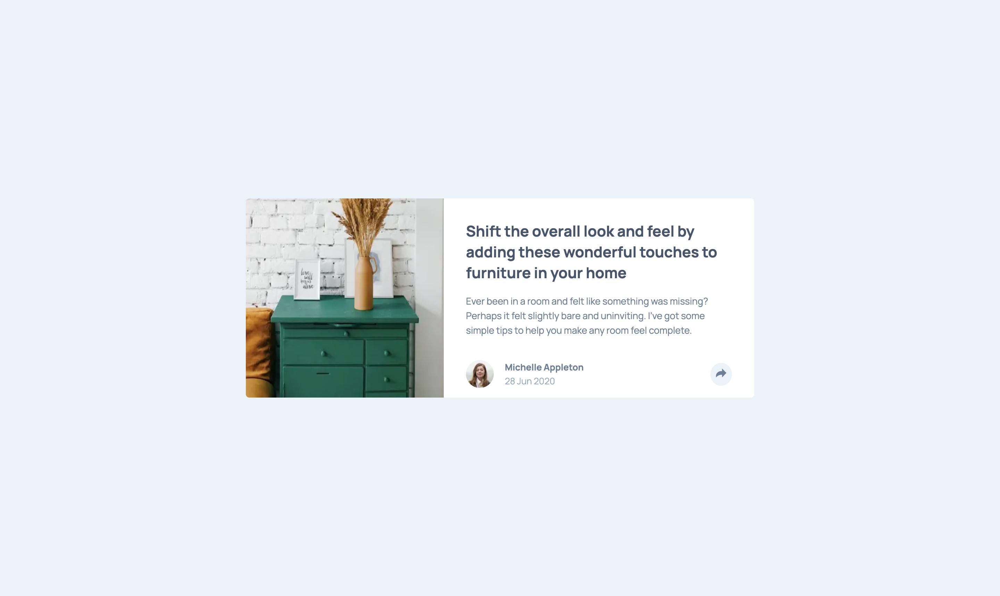

# Frontend Mentor - Article preview component solution

This is a solution to the [Article preview component challenge on Frontend Mentor](https://www.frontendmentor.io/challenges/article-preview-component-dYBN_pYFT). Frontend Mentor challenges help you improve your coding skills by building realistic projects. 

## Table of contents

- [Overview](#overview)
  - [The challenge](#the-challenge)
  - [Screenshot](#screenshot)
  - [Links](#links)
- [My process](#my-process)
  - [Built with](#built-with)
  - [What I learned](#what-i-learned)
  - [Continued development](#continued-development)
- [Author](#author)

## Overview

### The challenge

Users should be able to:

- View the optimal layout for the component depending on their device's screen size
- See the social media share links when they click the share icon

### Screenshot

### Links

- Solution URL: [https://github.com/rickMcGavin/fe-mentor-article-preview](https://github.com/rickMcGavin/fe-mentor-article-preview)
- Live Site URL: [https://fe-mentor-article-preview-bice.vercel.app/](https://fe-mentor-article-preview-bice.vercel.app/)

## My process

### Built with

- Mobile-first workflow
- [React](https://reactjs.org/) - JS library
- [Next.js](https://nextjs.org/) - React framework
- [Styled Components](https://styled-components.com/) - For styles
- [React Spring](https://github.com/pmndrs/react-spring) - For animations

### What I learned

Again coding mobile first was a great idea. It made getting the initial work completed easy, and then scaling it up to desktop sort of just seemed like a breeze.

I was very pleased with the final results of the animations, especially desktop. On this project in particular I controlled the react-spring configurations by nesting ternaries. It's not very readable, but I give myself extra cool points for doing it. I also realized you can control the clamp of the config and other spring settings with different states. 

### Continued development

If I was going to finish this, or come across this again, I'd work harder to match the image position and scale with the design. I thought it looked fine as it was, but in the future should definitely take the time to figure out how to do what the design is calling for.

## Author

- Website - [Rick McGavin](https://rickmcgavin.github.io)
- Frontend Mentor - [@rickMcGavin](https://www.frontendmentor.io/profile/rickMcGavin)
- Twitter - [@rickMcGavin](https://www.twitter.com/rickMcGavin)